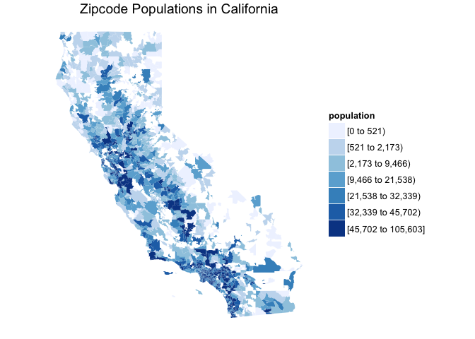
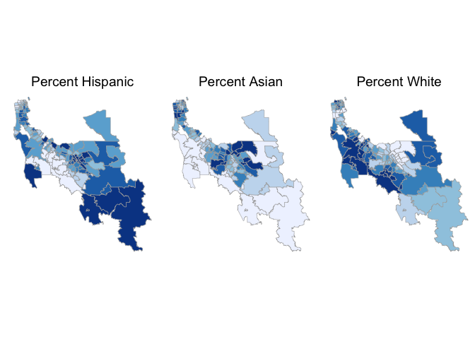
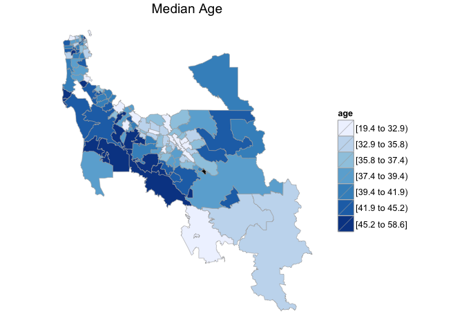
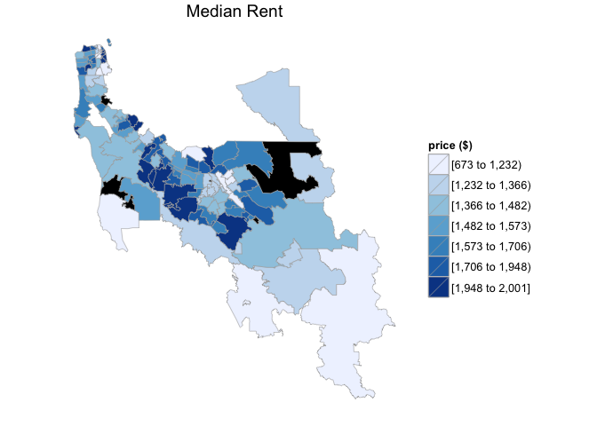
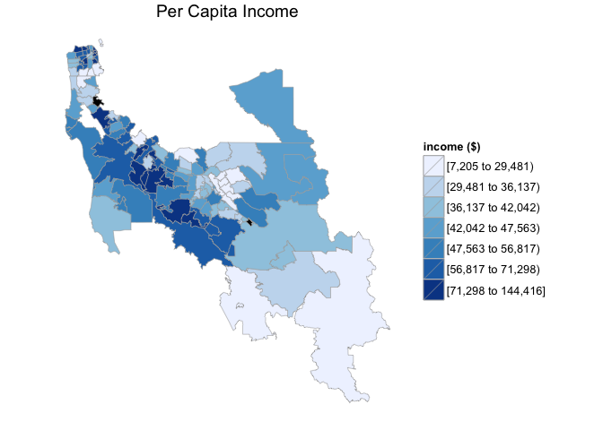

# Mapping Zipcode Demographics in California for 2012
David Clark  
October 12, 2015  

Install the required packages:


```r
library(devtools)
library(choroplethrZip)
library(ggplot2)
library(gridExtra)
```


Inspect the data:


```r
data(df_pop_zip)
head(df_pop_zip)
```

```
##     region value
## 132  01001 17380
## 133  01002 28718
## 134  01003 11286
## 135  01005  5120
## 136  01007 14593
## 137  01008  1160
```

Map zipcode populations in California:


```r
c = ZipChoropleth$new(df_pop_zip)
c$title = "Zipcode Populations in California"
c$ggplot_polygon = geom_polygon(aes(fill = value),
                                color=NA)
c$set_zoom_zip(state_zoom = "california",
               county_zoom=NULL,
               msa_zoom=NULL,
               zip_zoom=NULL)
c$legend = "population"

c$render()
```

 

##Statistics for San Francisco, San Mateo and Santa Clara counties##

**County FIPS for the Peninsula:**

* San Francisco County: 06075

* San Mateo County: 06081

* Santa Clara County: 06085


```r
peninsula_fips = c(06075, 06081, 06085)
```

Load demographic data for zipcodes:


```r
data(df_zip_demographics)
colnames(df_zip_demographics)
```

```
## [1] "region"            "total_population"  "percent_white"    
## [4] "percent_black"     "percent_asian"     "percent_hispanic" 
## [7] "per_capita_income" "median_rent"       "median_age"
```

###Percent Hispanic, Asian and White populations:###
Populations for San Francisco, San Mateo and Santa Clara counties.


```r
df_zip_demographics$value = df_zip_demographics$percent_hispanic
percentHispanic = zip_choropleth(df_zip_demographics, county_zoom=peninsula_fips, title="Percent Hispanic") +
                theme(legend.position="none")

df_zip_demographics$value = df_zip_demographics$percent_asian
percentAsian = zip_choropleth(df_zip_demographics, county_zoom=peninsula_fips, title="Percent Asian") +
                theme(legend.position="none")

df_zip_demographics$value = df_zip_demographics$percent_white
percentWhite = zip_choropleth(df_zip_demographics, county_zoom=peninsula_fips, title="Percent White") +
                theme(legend.position="none")

grid.arrange(percentHispanic, percentAsian, percentWhite, ncol=3)
```

 

###Median Age, Median Rent, and Per Capita Income:###
Median age, median rent, and per capita income for San Francisco, San Mateo and Santa Clara counties.


```r
df_zip_demographics$value = df_zip_demographics$median_age
zip_choropleth(df_zip_demographics, county_zoom=peninsula_fips, title="Median Age", legend = "age")
```

 

```r
df_zip_demographics$value = df_zip_demographics$median_rent
zip_choropleth(df_zip_demographics, county_zoom=peninsula_fips, title="Median Rent", legend = "price ($)")
```

 

```r
df_zip_demographics$value = df_zip_demographics$per_capita_income
zip_choropleth(df_zip_demographics, county_zoom=peninsula_fips, title="Per Capita Income", legend = "income ($)")
```

 

